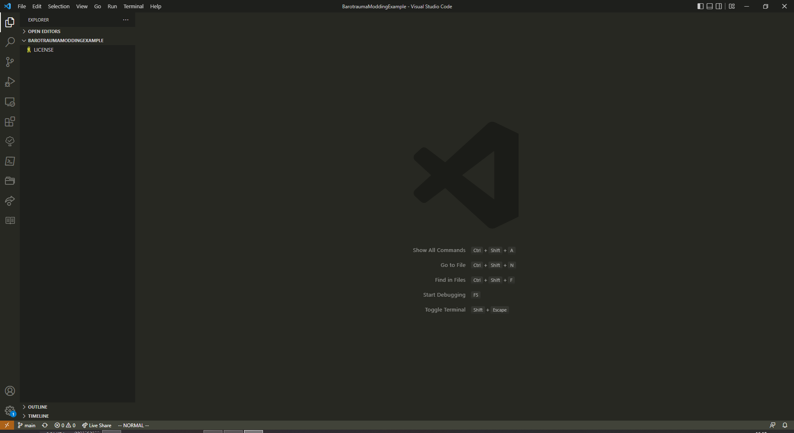
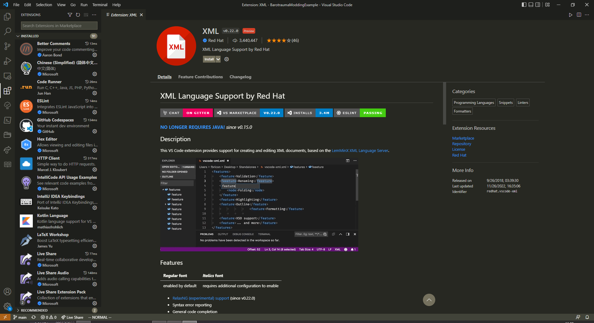
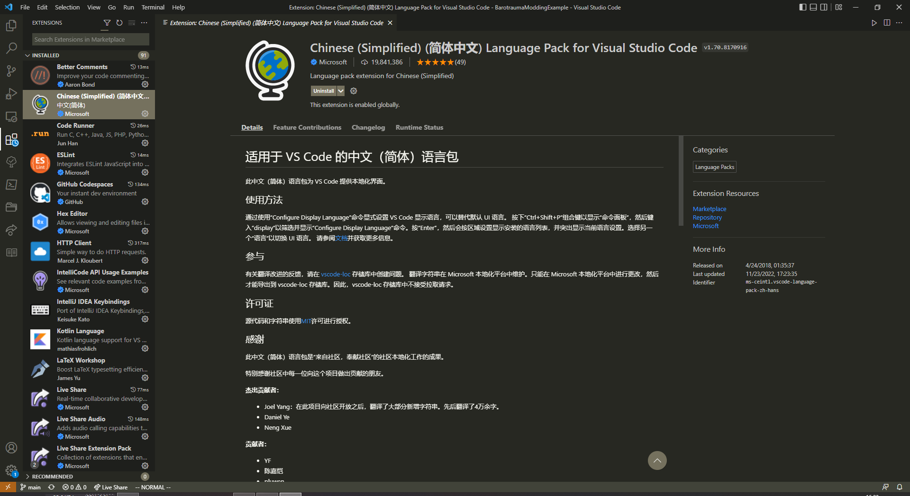

# 本教程面向零基础学习者，因此先从环境搭建开始

## 编辑器安装

---

### 下载 [VSCode](https://code.visualstudio.com/)

- VSCode 是由微软开发的代码编辑器，可以理解为“多功能记事本”。

- vscode 的界面如下，左侧一列为标签栏，第二列是文件资源管理器，第三列是代码编辑窗口

  - 先下载必要的插件：

    - xml 插件

    - 汉化插件（如果需要）

---

## 模组文件的格式

### 内容包

内容包是文件的集合，用于定义潜渊症中存在的事物的许多属性。这包括物品，结构，怪物，随机事件，关卡生成参数，作业等。

默认情况下，游戏使用名为“Vanilla”的单个内容包。任何其他内容包都可以被视为对游戏内容的修改，即“mod”。

内容包主要由称为 XML 格式的文本文件以及任何所需的纹理和声音组成。

XML 只是一种标签标记语言，远远谈不上编程语言的范畴，编写它就像编辑配置文件那样简单！只需要找到对应的标签，然后修改即可。

首先，我们需要新建文件夹(名字随意，但最好有意义，并且 **绝对** 不要使用中文或特殊符号)作为我们模组文件的根目录，在其内创建一个名为`filelist.xml`的文件。

`filelist`，也就是文件列表的意思。这个文件如同目录一般告诉模组加载器有哪些文件需要被加载，`filelist`的存在是一种约定，模组加载器会依次到每个模组的目录下读取此文件。

此文件中的代码应当如下所示：

```xml
<!--这一行指明了当前xml文件所使用的xml语言的版本，以及文件所使用的编码。必须存在，内容无需更改。-->
<?xml version="1.0" encoding="utf-8"?>

<!--
    此标签定义了模组的一系列内容
    name：玩家在游戏中看到的内容包的名称。
    modversion：模组的版本号。通常随着模组的更新而递增。
    gameversion：表示此模组基于什么版本的游戏开发。游戏可以使用它来检测需要修改以向后兼容的模组。
    corepackage：内容包是否为“核心”包，在单独的部分中描述。
    此标签内可以用的子标签已列举在下方，这些标签对应了在游戏中各种 对象 的类型。比如物品，生物等。
-->
<contentpackage name="my_first_mod" modversion="1.3.1" corepackage="False" steamworkshopid="2865579023" gameversion="0.19.10.0" expectedhash="3601641CD5A8262D2CA935705F3D1597">
    <!--
        举例：此标签指向了具体的文件
        %ModDir%: 模组根目录，也就是上文创建的文件夹
    -->
    <Item file="%ModDir%/Items/creatureloot.xml" />
</contentpackage>
```

### 可用标签列表,其中部分文档引用自其他教程

#### **注：值类型见后文**

- [Item](examples/Item.md)
